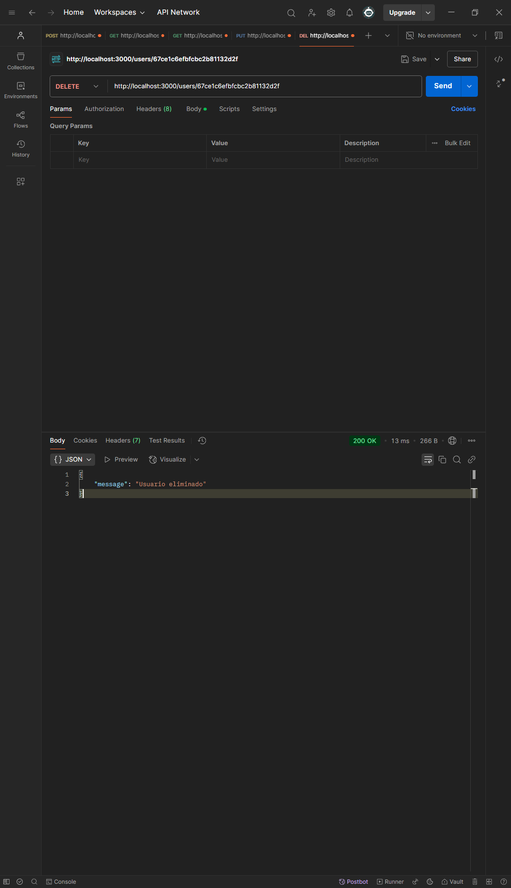
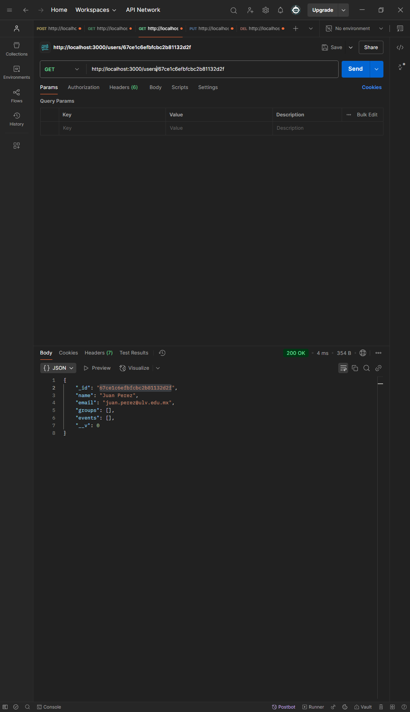

# api_SocialNetwork_GROUPS


Este es un proyecto de API desarrollado con Node.js y mongoose que permite gestionar grupos en una red social, desde crear un usuarios, hasta crear un grupo y agregar un evento, utilizando el modelado referencing, para tener un buen manejo de la informacion.

## **Tabla de Contenidos**
- [Explicacion sobre la estructura elegida](explicacion-sobre-la-estructura-elegida)
- [Justificacion de las decisiones de modelado](justificacion-de-las-decisiones-de-modelado)
- [Tecnologías utilizadas](tecnologías-utilizadas)
- [Instalación](#instalación)
- [Estructura del Proyecto](#estructura-del-proyecto)
- [Uso](#uso)
- [Rutas de la API](#rutas-de-la-api)
  - [Usuarios](#usuarios)
  - [Grupos](#grupos)
  - [Eventos](#eventos)
- [Ejemplos con Postman](#ejemplos-con-postman)
- [Contribuir](#contribuir)

---
## **Explicacion sobre la estructura elegida**

Esta api sigue una estructura organizada dentro de la carpeta src, donde los modelos de datos estan en models, manteniendo una separacion clara entre las tres entidades (User, Group y Event). El archivo principal (index.js) se encarga de iniciar el servidor, configurar el API y contiene los controladores de las entidades. Ademas, se hace uso del archivo .env para gestionar la unica variable de entorno que se tiene, agregando un nivel mas de seguridad a nuestra API. Esta organizacion facilta la escalabilidad y el mantenimiento del codigo.

## **Justificacion de las decisiones de modelado**

En esta ocacion se opto por utilizar un modelado basado en referfencias (referencing) en MongoDB mediante Mongoose, permitiendo que el manejo de las relaciones entre usuarios, grupos y eventos sea mas eficiendo sin tener la necesidad de duplicar informacion innecesaria. 

En el esquema de usuarios, se almacenan referencias a los grupos y eventos en los que participa el usuario, evitando la duplicacion de datos y permitiendo consultas mas eficientes. 

Por otro lado, el esquema de grupos contiene referecnias solo a los usuarios que son miembros del grupo, al igual que se almacena inforemacion sobre los eventos asociados. Para póder registrar lña fecha de ingreso que cada ususario se utilizo un esquema enbebido.

Del mismo modo, eventos mantiene una relacion con los grupos a los que pertenece y los usuarios que son participantes, asegurando que la informacion en la red social sea facil de recuperar y de gestionar.

Es de este modo que haciendo uso de referencias dentro de los esquemas se mejora el rendimiento en consultas donde se necesite acceder a los datos relacionados, permientiendo obtener informacion detallada cuando sea necesario, sin cargar de mas la base de datos con duplicaciones.

## **Tecnologías utilizadas**

*   Node.js
*   Express
*   MongoDB
*   Mongoose
*   dotenv
*   cors

## Instalación

1.  Clona este repositorio:

    git clone https://github.com/SooyAldahir/api_SocialNetwork_GROUPS.git


2.  Instala las dependencias:

    npm install    


3.  Crea un archivo .env en la raíz del proyecto y añade la URI de conexión a tu base de datos MongoDB:

    MONGO_URI = mongodb://127.0.0.1:27017/{tuBaseDeDatos}
   

## **Estructura del Proyecto**
```
📂 src
├── 📂 models               # Modelos de datos con Mongoose
│ ├── 📄 userModel.js      # Modelo de Usuario
│ ├── 📄 groupModel.js     # Modelo de Grupo
│ ├── 📄 eventModel.js     # Modelo de Evento
├── 📄 index.js            # Archivo principal que inicia el servidor
├── 📄 .env                 # Variables de entorno (no incluir en el repositorio)
├── 📄 package.json         # Dependencias y configuración del proyecto
```

## Uso

1.  Inicia el servidor:
    
bash
    node server.js

2.  La API estará disponible en http://localhost:3000 (o el puerto que hayas configurado).

## **Rutas de la API**

### **Usuarios**
- **Crear un usuario** (`POST /users`)
    ```json
    {
        "name": "Aldahir Ballina",
        "email": "aldahir.ballina@ulv.edu.mx",
        "groups": [
          "67ca4eb8f791f5b6d2039605", 
          "67cdf9cf6b542d6949c0e320"],
        "events": [
          "67ca559ab8dc1904ab7b7aa5", 
          "67ca5523b8dc1904ab7b7aa3"]
    }
    ```
- **Obtener todos los usuarios** (`GET /users`)
- **Obtener un usuario por ID** (`GET /users/id`)
- **Editar** (`POST /users/id`)
    ```json
    {
        "name": "Aldahir Emmauel Ballina Núñez",
        "email": "aldahir.ballina@ulv.edu.mx",
        "groups": [
          "67ca4eb8f791f5b6d2039605", 
          "67cdf9cf6b542d6949c0e320"],
        "events": [
          "67ca559ab8dc1904ab7b7aa5", 
          "67ca5523b8dc1904ab7b7aa3"]
    }
    ```
- **Eliminar** (`DELETE /users/:id`)

### **Grupos**
- **Crear un grupo** (`POST /groups`)
    ```json
    {
        "name": "Clase de graduandos 2026",
        "description": "Grupo de proximos a egresar de la carrera de ingenieria en desarrollo de software",
        "members": [
          {
            "user": "67ca4118f791f5b6d20395fb",
            "registerDate": "2022-08-15"
          },
          {
            "user": "67ca414bf791f5b6d20395fd",
            "registerDate": "2022-08-15"
          },
          {
            "user": "67ca4162f791f5b6d20395ff",
            "registerDate": "2022-08-15"
          },
          {
            "user": "67ca4178f791f5b6d2039601",
            "registerDate": "2022-08-15"
          }
        ],
        "events": []
    }

    ```
- **Obtener todos los grupos** (`GET /groups`)
- **Obtener un grupo por ID** (`GET /groups/id`)
- **Editar** (`POST /groups/id`)
    ```json
    {
        "name": "Clase de graduandos 2026",
        "description": "Grupo de proximos a egresar de la carrera de ingenieria en desarrollo de software",
        "members": [
          {
            "user": "67ca4118f791f5b6d20395fb",
            "registerDate": "2022-08-15"
          },
          {
            "user": "67ca414bf791f5b6d20395fd",
            "registerDate": "2022-08-15"
          },
          {
            "user": "67ca4162f791f5b6d20395ff",
            "registerDate": "2022-08-15"
          },
          {
            "user": "67ca4178f791f5b6d2039601",
            "registerDate": "2022-08-15"
          }
        ],
        "events": [
           { 
            "event": "67ca5523b8dc1904ab7b7aa3",
            "date": "2025-10-15",
            "description": "Reunion para decidir la comido de la cena del evento"
            }
        ]
    }

    ```
- **Eliminar** (`DELETE /groups/:id`)

### **Eventos**
- **Crear un evento** (`POST /events`)
    ```json
   {
        "name": "Hackathon Universitario",
        "date": "2025-03-15",
        "place": "Auditorio Debora Trujillo",
        "description": "Competencia de programación intensiva de 12 horas",
        "groups": "67ca4eb8f791f5b6d2039605",
        "participants": [
          "67ca4118f791f5b6d20395fb",
          "67ca414bf791f5b6d20395fd"
        ]
  }

    ```
- **Obtener todos los eventos** (`GET /events`)
- **Obtener un evento por ID** (`GET /events/id`)
- **Editar** (`POST /events/id`)
    ```json
    {
        "name": "Hackathon Universitario",
        "date": "2025-03-15",
        "place": "Salon de computo del eficio C",
        "description": "Competencia de programación intensiva de 12 horas",
        "groups": "67ca4eb8f791f5b6d2039605",
        "participants": [
          "67ca4118f791f5b6d20395fb",
          "67ca414bf791f5b6d20395fd"
        ]
  }

    ```
- **Eliminar** (`DELETE /events/:id`)
---

## Modelo de datos

## Usuarios:

```javascript
const userSchema = new Schema({
    name: {
        type: String, 
        required: true},
    email: {
        type: String, 
        required: true},
    groups: [{
        type: mongoose.Schema.Types.ObjectId, 
        ref: 'Group'}],
    events: [{
        type: mongoose.Schema.Types.ObjectId, 
        ref: 'Event'}]
});
```
## Grupos:

```javascript
const groupSchema = new mongoose.Schema({  
    name: { 
      type: String, 
      required: true },  
    description: String,  
    members: [{  
      user: { 
        type: mongoose.Schema.Types.ObjectId, 
        ref: 'User' },  
      registerDate: { 
        type: Date, default: Date.now }  
    }],  
    events: [{  
      event: {
        type: mongoose.Schema.Types.ObjectId, 
        ref: 'Events' },  
      date: Date,  
      description: String  
    }]  
  });  
```
## Eventos:

```javascript
const eventSchema = new mongoose.Schema({  
    name: { 
      type: String, 
      required: true },  
    date: Date, 
    place: { 
      type: String, 
      required: true }, 
    description: String,  
    group: { 
      type: mongoose.Schema.Types.ObjectId, 
      ref: 'Group' },
    participants: [{  
      type: mongoose.Schema.Types.ObjectId, 
       ref: 'User'
    }]
  }); 
```

## **Ejemplos con Postman**
### **Crear un Usuario**

```sh
POST http://localhost:3000/users

{
        "name": "Aldahir Ballina",
        "email": "aldahir.ballina@ulv.edu.mx",
        "groups": [
          "67ca4eb8f791f5b6d2039605", 
          "67cdf9cf6b542d6949c0e320"],
        "events": [
          "67ca559ab8dc1904ab7b7aa5", 
          "67ca5523b8dc1904ab7b7aa3"]
}
```    
### **Obtener todos los Usuarios**
```sh
GET http://localhost:3000/users

[
    {
        "_id": "67ca4118f791f5b6d20395fb",
        "name": "Aldahir Ballina",
        "email": "aldahir.ballina@ulv.edu.mx",
        "groups": [],
        "events": [],
        "__v": 0
    },
    {
        "_id": "67ca414bf791f5b6d20395fd",
        "name": "Emmanuel Chavez",
        "email": "emmanuel.chavez@ulv.edu.mx",
        "groups": [],
        "events": [],
        "__v": 0
    }
]
```
### **Obtener un solo Usuario**
```sh
GET http://localhost:3000/users/67ca4178f791f5b6d2039601

{
    "_id": "67ca4178f791f5b6d2039601",
    "name": "Erik Perez",
    "email": "erik.perez@ulv.edu.mx",
    "groups": [],
    "events": [],
    "__v": 0
}
```
### **Actualizar un Usuario**
```sh
PUT http://localhost:3000/users/67ca4118f791f5b6d20395fb

{
        "name": "Aldahir Emmanuel Ballina Núñez",
        "email": "aldahir.ballina@ulv.edu.mx",
        "groups": [
          "67ca4eb8f791f5b6d2039605", 
          "67cdf9cf6b542d6949c0e320"],
        "events": [
          "67ca559ab8dc1904ab7b7aa5", 
          "67ca5523b8dc1904ab7b7aa3"]
}
```  
### **Eliminar un Usuario**
```sh
DELETE http://localhost:3000/users/67ca4118f791f5b6d20395fb

{
    "message": "Usuario eliminado"
}
```  

### **Crear un Grupo**

```sh
POST http://localhost:3000/groups

{
        "name": "Clase de graduandos 2026",
        "description": "Grupo de proximos a egresar de la carrera de ingenieria en desarrollo de software",
        "members": [
          {
            "user": "67ca4118f791f5b6d20395fb",
            "registerDate": "2022-08-15"
          },
          {
            "user": "67ca414bf791f5b6d20395fd",
            "registerDate": "2022-08-15"
          },
          {
            "user": "67ca4162f791f5b6d20395ff",
            "registerDate": "2022-08-15"
          },
          {
            "user": "67ca4178f791f5b6d2039601",
            "registerDate": "2022-08-15"
          }
        ],
        "events": []
    }
```    
### **Obtener todos los Grupos**
```sh
GET http://localhost:3000/groups

[
    {
        "_id": "67ca4eb8f791f5b6d2039605",
        "name": "Grupo de Desarrollo Web",
        "description": "Grupo dedicado a aprender sobre tecnologías web modernas",
        "members": [
            {
                "user": "67ca4118f791f5b6d20395fb",
                "registerDate": "2025-03-06T12:00:00.000Z",
                "_id": "67cb1b7af1b8f3e3e2d2a373"
            },
            {
                "user": "67ca414bf791f5b6d20395fd",
                "registerDate": "2025-03-07T15:30:00.000Z",
                "_id": "67cb1b7af1b8f3e3e2d2a374"
            },
            {
                "user": "67ca4162f791f5b6d20395ff",
                "registerDate": "2025-03-06T12:00:00.000Z",
                "_id": "67cb1b7af1b8f3e3e2d2a375"
            },
            {
                "user": "67ca4178f791f5b6d2039601",
                "registerDate": "2025-03-07T15:30:00.000Z",
                "_id": "67cb1b7af1b8f3e3e2d2a376"
            }
        ],
        "events": [],
        "__v": 0
    }
]
```
### **Obtener un solo Grupo**
```sh
GET http://localhost:3000/users/67ca4178f791f5b6d2039601

{
    "_id": "67ca4eb8f791f5b6d2039605",
    "name": "Grupo de Desarrollo Web",
    "description": "Grupo dedicado a aprender sobre tecnologías web modernas",
    "members": [
        {
            "user": "67ca4118f791f5b6d20395fb",
            "registerDate": "2025-03-06T12:00:00.000Z",
            "_id": "67cb1b7af1b8f3e3e2d2a373"
        },
        {
            "user": "67ca414bf791f5b6d20395fd",
            "registerDate": "2025-03-07T15:30:00.000Z",
            "_id": "67cb1b7af1b8f3e3e2d2a374"
        },
        {
            "user": "67ca4162f791f5b6d20395ff",
            "registerDate": "2025-03-06T12:00:00.000Z",
            "_id": "67cb1b7af1b8f3e3e2d2a375"
        },
        {
            "user": "67ca4178f791f5b6d2039601",
            "registerDate": "2025-03-07T15:30:00.000Z",
            "_id": "67cb1b7af1b8f3e3e2d2a376"
        }
    ],
    "events": [],
    "__v": 0
}
```
### **Actualizar un Grupo**
```sh
PUT http://localhost:3000/users/67ca4118f791f5b6d20395fb

{
    "_id": "67ca4eb8f791f5b6d2039605",
    "name": "Grupo de Desarrollo Web",
    "description": "Grupo dedicado a aprender sobre tecnologías web modernas",
    "members": [
        {
            "user": "67ca4118f791f5b6d20395fb",
            "registerDate": "2025-03-06T12:00:00.000Z",
            "_id": "67cb1b7af1b8f3e3e2d2a373"
        },
        {
            "user": "67ca414bf791f5b6d20395fd",
            "registerDate": "2025-03-07T15:30:00.000Z",
            "_id": "67cb1b7af1b8f3e3e2d2a374"
        },
        {
            "user": "67ca4162f791f5b6d20395ff",
            "registerDate": "2025-03-06T12:00:00.000Z",
            "_id": "67cb1b7af1b8f3e3e2d2a375"
        },
        {
            "user": "67ca4178f791f5b6d2039601",
            "registerDate": "2025-03-07T15:30:00.000Z",
            "_id": "67cb1b7af1b8f3e3e2d2a376"
        }
    ],
    "events": [
        {
            "event": "67ca5523b8dc1904ab7b7aa3",
            "date": "2025-03-15T10:00:00.000Z",
            "description": "Hackaton",
            "_id": "67cb1b7af1b8f3e3e2d2a377"
        },
        {
            "event": "67ca559ab8dc1904ab7b7aa5",
            "date": "2025-03-20T14:00:00.000Z",
            "description": "Misa",
            "_id": "67cb1b7af1b8f3e3e2d2a378"
        }
    ],
    "__v": 0
}
```  
### **Eliminar un Grupo**
```sh
DELETE http://localhost:3000/groups/67ca4eb8f791f5b6d2039605

{
    "message": "Grupo eliminado"
}
```   
### **Crear un Evento**

```sh
POST http://localhost:3000/events

{
        "name": "Reunion cena de graduandos",
        "date": "2025-06-12",
        "place": "SUM",
        "description": "Se llevara cabo la votacion para la cena de graduandos",
        "groups": ["67ca4eb8f791f5b6d2039605"],
        "participants": [
          "67ca4118f791f5b6d20395fb",
          "67ca414bf791f5b6d20395fd",
          "67ca4162f791f5b6d20395ff",
          "67ca4178f791f5b6d2039601"
        ]
}
```    
### **Obtener todos los Eventos**
```sh
GET http://localhost:3000/events

[
    {
        "groups": [],
        "_id": "67ca5523b8dc1904ab7b7aa3",
        "name": "Hackathon Universitario",
        "date": "2025-03-15T00:00:00.000Z",
        "place": "Laboratorio del Edificio C",
        "description": "Competencia de programación intensiva de 12 horas",
        "group": "67ca4eb8f791f5b6d2039605",
        "participants": [
            "67ca4118f791f5b6d20395fb",
            "67ca414bf791f5b6d20395fd"
        ],
        "__v": 0
    },
    {
        "groups": [],
        "_id": "67ca559ab8dc1904ab7b7aa5",
        "name": "Se cambia la misa del Domingo para el miercoles",
        "date": "2025-03-20T00:00:00.000Z",
        "place": "Capilla Catolica",
        "description": "Comer la ostia",
        "group": "67ca4eb8f791f5b6d2039605",
        "participants": [
            "67ca4118f791f5b6d20395fb",
            "67ca414bf791f5b6d20395fd"
        ],
        "__v": 0
    },
    {
        "_id": "67ce14fafbfcbc2b81132d0f",
        "name": "Reunion cena de graduandos",
        "date": "2025-06-12T00:00:00.000Z",
        "place": "SUM",
        "description": "Se llevara cabo la votacion para la cena de graduandos",
        "groups": [
            "67ca4eb8f791f5b6d2039605",
            "67ca4eb8f791f5b6d2039605"
        ],
        "participants": [
            "67ca4118f791f5b6d20395fb",
            "67ca414bf791f5b6d20395fd",
            "67ca4162f791f5b6d20395ff",
            "67ca4178f791f5b6d2039601"
        ],
        "__v": 0
    }
]
```
### **Obtener un solo Evento**
```sh
GET http://localhost:3000/events/67ca4178f791f5b6d2039601

{
    "_id": "67ce14fafbfcbc2b81132d0f",
    "name": "Reunion cena de graduandos",
    "date": "2025-06-12T00:00:00.000Z",
    "place": "SUM",
    "description": "Se llevara cabo la votacion para la cena de graduandos",
    "groups": [
        "67ca4eb8f791f5b6d2039605",
        "67ca4eb8f791f5b6d2039605"
    ],
    "participants": [
        "67ca4118f791f5b6d20395fb",
        "67ca414bf791f5b6d20395fd",
        "67ca4162f791f5b6d20395ff",
        "67ca4178f791f5b6d2039601"
    ],
    "__v": 0
}
```
### **Actualizar un Evento**
```sh
PUT http://localhost:3000/events/67ce14fafbfcbc2b81132d0f

{
        "name": "Reunion cena de graduandos",
        "date": "2025-10-12",
        "place": "SUM",
        "description": "Se llevara cabo la votacion para la cena de graduandos",
        "groups": ["67ca4eb8f791f5b6d2039605"],
        "participants": [
          "67ca4118f791f5b6d20395fb"
        ]
}
```  
### **Eliminar un Evento**
```sh
DELETE http://localhost:3000/events/67ce14fafbfcbc2b81132d0f

{
    "message": "Evento eliminado"
}
```  

## **Ejemplo de Uso**

Aquí tienes un ejemplo del sistema funcionando mostrando todos los usuarios:


Aquí tienes un ejemplo del sistema funcionando eliminando un usuario:



Aquí tienes un ejemplo del sistema funcionando buscando un usuario:



Aquí tienes un ejemplo del sistema funcionando creando un nuevo usuario:


Aquí tienes un ejemplo del sistema funcionando actualizando un usuario:


Aquí tienes un ejemplo del sistema funcionando mostrando todos los grupos:


Aquí tienes un ejemplo del sistema funcionando eliminando un grupo:


Aquí tienes un ejemplo del sistema funcionando buscando un grupo:


Aquí tienes un ejemplo del sistema funcionando creando un nuevo grupo:


Aquí tienes un ejemplo del sistema funcionando actualizando un grupo:


---

Aquí tienes un ejemplo del sistema funcionando actualizando un evento:


Aquí tienes un ejemplo del sistema funcionando eliminando un evento:


Aquí tienes un ejemplo del sistema funcionando mostrando todos los eventos:


Aquí tienes un ejemplo del sistema funcionando buscando un evento:


Aquí tienes un ejemplo del sistema funcionando creando un nuevo evento:


---

## **Contribuir**
1. Haz un fork del repositorio.
2. Crea una nueva rama (`git checkout -b feature/nueva-funcionalidad`).
3. Realiza tus cambios y haz commit (`git commit -m "Agrego nueva funcionalidad"`).
4. Sube los cambios a tu fork (`git push origin feature/nueva-funcionalidad`).
5. Abre un Pull Request para revisar los cambios.

¡Gracias por contribuir! 🚀
